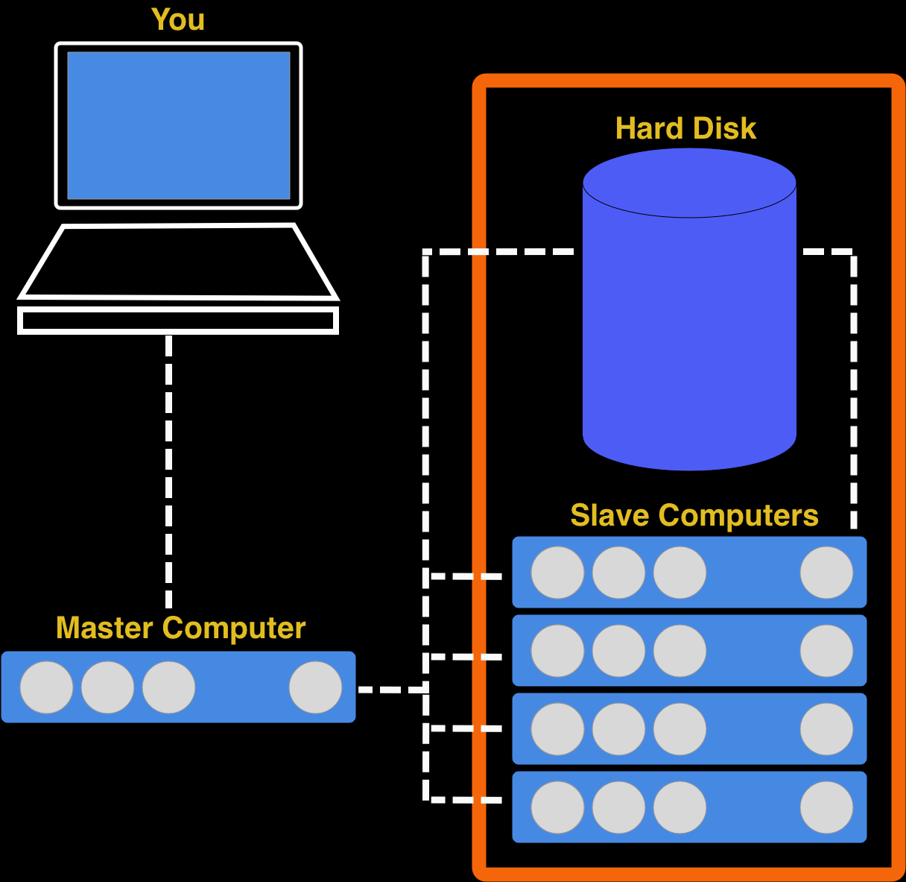
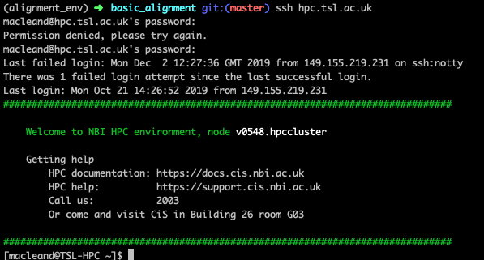

# Running an alignment on the HPC

In this chapter we'll look at how to run the alignment on an HPC cluster. First, we need to know a few things about that HPC before we can begin.

## An HPC is a group of slave computers under control of a master computer

Most of the computers in an HPC cluster are really just there to do what one other computer tells them. They cannot be contacted directly (by the normal user) and they have very little software already on them. As the user you must get a master computer to tell them what to do. A key thing about an HPC cluster is that all the computers share one massive hard-drive. Look at the diagram below. 



It shows the computer you are working at, the master computer and it's relation to the slave computers and the hard disk. Note that there is no way for you to contact the slaves directly, even though the slaves (or more properly 'worker nodes') are where the actual job runs. So the workflow for running an HPC job goes like this

  1. Log into master (more usually called 'submission node' )
  2. Prepare a task for the submission node to send to the nodes
  3. Submit the task to the submission node
  4. Wait for the submission node to send the job to the worker nodes
  5. Wait for the worker nodes to finish the job
  
In the rest of this chapter we'll look at how to do these steps

## Logging into the submission node

This is pretty straightforward, you need to use the `ssh` command to make a connection between your computer and the submission node. The TSL submission node has the address `hpc.tsl.ac.uk` so use this command

```
ssh hpc.tsl.ac.uk
```

You'll be asked for a user name and password, it's your usual NBI details. When it's done you should see something like this




This terminal is now working on the submission node (you can tell from the prompt `macleand@TSL-HPC`)

## Preparing a job

To run a job we need to create a submission script. `nano` is available on the submission node, so we can use that. But what goes inside? Here's a typical one.

```
#!/bin/bash

#SBATCH -p tsl-short
#SBATCH --mem=16G
#SBATCH -c 4
#SBATCH -J alignments
#SBATCH --mail-type=begin,end,fail
#SBATCH --mail-user=dan.maclean@tsl.ac.uk
#SBATCH -o alignments.%j.out
#SBATCH -e slurm.%j.err

source minimap2-2.5
source samtools-1.9

srun minimap2 -ax sr ecoli_genome.fa ecoli_left_R1.fq ecoli_right_R2.fq | samtools view -S -h -b -q 25 -f 3 > aln.script.bam

```


Not much of this is going to be familiar, but it isn't complicated. 

The first line of this file `#!/bin/bash` is one that should always be there. Always put it in and never worry about it again. It just tells the computer this file is a script.

### The `#SBATCH` options

The second block of statements, all beginning `#SBATCH` are the resource options for the job. It tells the submission node what resources the job needs to run. These need to go at the top of the script. Let's look at them individually.

#### `#SBATCH -p`

This tells the submission node which queue (or partition in the jargon) the job should run on. We have three basic partitions `tsl-short`, `tsl-medium` and `tsl-long`. The main difference is that jobs that run for a short time shouldn't be held back by jobs that run for ages, so the submission node uses this to run all of its jobs optimally.

#### `#SBATCH -c`

The number here tells the machine how many CPU's (processors) to use. Most tools will be able to make use of more than one and will run faster as a consequence. The job (usually) won't fail if you get this wrong, but it will take longer to start as it waits for more CPU's to come free.

#### `#SBATCH --mem=` 

This tells the submission node how much memory your job will need to run. Jobs that exceed their stated memory by too much are killed. REquestiing the lowest possible memory means your job will be executed more quickly. Memory is requested in units of `G` gigabytes, usually.

#### `#SBATCH -J`

This is a helpful little name for you to identify your jobs with. eg `#SBATCH -J my_jobs`

#### `#SBATCH --mail-type=`

These are the times during the job that the submission node will email you to let you know of a status change in your job. Always use this option as presented for quickest information.

#### `#SBATCH --mail-user`

This is simply the address your update emails will be sent to.

#### `#SBATCH -o` and `#SBATCH -e` 

These are the names of files that output and errors will be sent to. On a long running process the output can get long so it goes to a file, not the email. The weird `%j` is a job ID number that uniquely identifies the job.


### The `source` options 

The next lines all begin with the word `source` followed by some software name. No software is loaded into the worker nodes by default, so we need to say which tools we want to use. Do this by using the `source` keyword followed by the software name, e.g `source BLAST-2.2.2`. Many versions of the same tool are available on the HPC, and are differentiated by the version number at the end. You can see which software is available to source by typing `source` then hitting the tab key twice. It should give a very long list of tools.

### The `srun` command

Finally, we get to the actual commands we want to run. This is exactly as we did before but with the command `srun` in front. 

## Submitting with `sbatch`

All of this information should be saved in a single script. You can call it what you want, but use the extension `.sh`. Once you've got this script, you can ask the submission node to add your job to the queue with `sbatch`. This doesn't go in the script, it goes on the command-line, so if you'd added all the details above to a file called `do_my_alignments.sh` you can submit it by typing `sbatch do_my_alignments.sh`

## Checkout tasks

So that's all you need to know to submit a job. Let's test how that works by creating a simple job and running that. Then we'll try a bigger alignment job. These are 


  1. Create a job using a submission script that runs this command `date`. Check what the `date` command does on the command line. Note that it runs very quickly (is a short job) and uses very little memory (< 1G) and only needs one CPU.
  2. What happened to the output? Check the contents of your directory when the job is done and examine the new files (`less` is useful for this). 
  3. Explicitly create an output file by running this command through the HPC instead `date > date.txt`. What is the contents of the folder now? What effect did explicitly naming an output file have. What is the `slurm_xxxx.out` file for?
  4. Run an alignment job using the information we learned in the earlier chapters. The reference file `ecoli_genome.fa`, `ecoli_left_R1.fq`, `ecoli_right_R2.fq` are available in the HPC filesystem in the folder. `/tsl/data/reads/bioinformatics/tutorial/alignments/` 
  
## Further Reading

You can see more information about the cluster submission system and options at the CiS [documentation site](https://docs.cis.nbi.ac.uk/display/CIS/Run+a+simple+job+on+the+cluster) 
